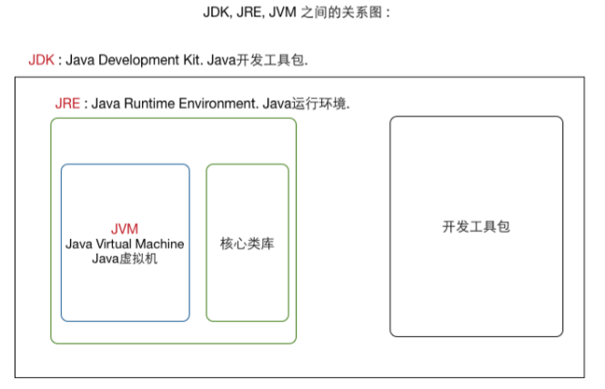

## 硬件和软件

* 硬件：计算机设备实物
* 软件： 一系列**数据**和**指令**的集合

## 软件分类

1. 系统软件：
         操作系统
         例如：windows、 linux 
2. 应用软件：运行在系统软件之上，满足客户的需求

## 硬盘和内存

* 硬盘：存储数据量大，可以做到数据的持久存储；数据的执行效率低
* 内存：存储数据量小，只能做到数据的临时存储；数据的执行效率高

## 人机交互

* 命令行（shell）：

    较早出现，需要记住特殊的指令，有一定的学习成本，不适合所有群体

* 图形化界面的方式（GUI）：
    出现较晚，不需要特殊指令，学习成本低，适合大部分群体

## 常用的dos指令

基础命令：

| 指令      | 操作               |
| --------- | ------------------ |
| `d: `     | 切换盘符           |
| `cd`      | 显示当前路径或更改 |
| `cd .`    | 当前位置           |
| `cd .. `  | 到上一层路径       |
| `cd \or/` | 到根目录           |
| `↑↓`      | 查找历史缓存       |
| `cls`     | 清屏               |
| `exit`    | 关闭退出           |
| `tab`     | 自动补全           |

tip：盘符不同先切盘符

进阶命令：（文件目录相关的操作）

| 指令                                                         | 操作                                                         |
| ------------------------------------------------------------ | ------------------------------------------------------------ |
| `md 路径信息（包含目录名）`                                  | 创建目录                                                     |
| `rd 路径信息（包含目录名）`                                  | 删除目录（删除的目录必须是空的）                             |
| ` copy con 路径信息（包含文件名）--> enter` `输入内容1` `输入内容2` `........` `输入内容n` `ctrl +Z 再按回车` | 创建文件 (将控制台信息拷贝到文件 如果没有文件就创建) |
| `copy 路径信息（包含文件名）con`                             | 打开文件 （将文件内容拷贝到控制台）                     |
| `echo 数据内容 > 文件名`                                     | 创建文件（覆盖原文件）                                       |
| `echo 数据内容 >> 文件名`                                    | 创建文件（追加内容）                                         |
| `del 路径信息（包含文件名）`                                 | 删除文件(直接删除，不走回收站) 当del指定的是文件夹名是，将删除文件夹下的所有文件（不删除子文件夹以及子文件夹中的文件） |

## Java 语言的由来

* 1995年诞生
* 1996年发布第一版jdk
* 2008年：SUM公司收购Mysql公司
* 2009年：Oracle公司收购了SUM公司 

## Java 语言的特点

* 开源免费
* 跨平台性（可移植性）
* 垃圾回收机制

## 跨平台性的原理

JVM ：Java 虚拟机

## JDK JRE JVM

JVM（Java Virtual Machine）：Java虚拟机

JRE(Java Runtime Environment): Java运行环境：JVM +核心类库

JDK(Java Development Kit):Java开发工具包 ：JER +开发的指令集/工具集

如果仅仅想要Java程序，安装JRE即可

如果想进行Java开发，需要JDK

