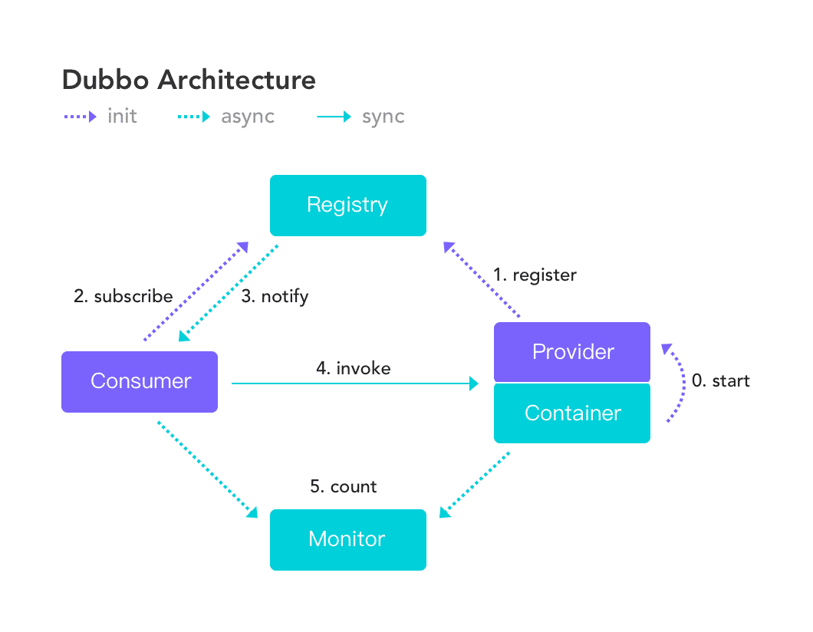

# 分布式系统

* 单机系统：

    将所有功能应用部署在一台服务器上，适用于小型系统，请求量少， 响应时间要求不高的情况

* 垂直系统：

    按需求划分出多个应用系统，部署在不同的服务器上，划分后系统后各自没有交互

    如果一个用户功能需要用到多个系统时，那么用户必须发起多次请求，才能完成功能。

* 分布式系统：

    和垂直系统一样，将不同的应用系统部署在不同服务器上，但不同应用系统之间可以相互调用请求，形成分布式网络。这样用户一次请求，可以调用多个系统功能

    系统间相互调用的通信方式是RPC(Remote Procedure Call)远程过程调用

# Dubbo框架简介

Dubbo是一款高性能、轻量级的开源Java RPC框架，它提供三大核心能力：

* 面向接口的远程方法调用
* 智能容错
* 均衡负载

它可以与Spring框架无缝集成

它的基本架构如图：



* 服务提供者（Provider）：暴露服务的服务提供方，服务提供者在启动时，向注册中心注册自己提供的服务。
* 服务消费者（Consumer）: 调用远程服务的服务消费方，服务消费者在启动时，向注册中心订阅自己所需的服务，服务消费者，从提供者地址列表中，基于软负载均衡算法，选一台提供者进行调用，如果调用失败，再选另一台调用。
* ​	注册中心（Registry）：注册中心返回服务提供者地址列表给消费者，如果有变更，注册中心将基于长连接推送变更数据给消费者 –如果信息有变，注册中心提供新的信息给消费者
* ​	监控中心（Monitor）：服务消费者和提供者，在内存中累计调用次数和调用时间，定时每分钟发送一次统计数据到监控中心 –监控服务提供者、消费者状态，与开发没有直接关系

调用关系说明:

* 服务容器spring负责启动，加载，运行服务提供者。
* 服务提供者在启动时，向注册中心注册自己提供的服务。
* 服务消费者在启动时，向注册中心订阅自己所需的服务。
* 注册中心返回服务提供者地址列表给消费者，如果有变更，注册中心将基于长连接推送变更数据给消费者。
* 服务消费者，从提供者地址列表中，基于软负载均衡算法，选一台提供者进行调用，如果调用失败，再选另一台调用。
* 服务消费者和提供者，在内存中累计调用次数和调用时间，定时每分钟发送一次统计数据到监控中心。


# Dubbo框架下的服务设计

* 将服务接口，服务模型，服务异常等放到公共包中

* 每个服务方法应代表一个功能，而不是某功能的一个步骤

    服务接口以业务场景为单位划分，并对相近业务做抽象

* 每个接口应定义版本号，区分同一接口的不同实现


# Dubbo直连方式基本配置

## 供应者

```xml
<!--设置dubbo服务名称，是唯一标识，服务名称是dubbo内部使用标识服务的-->
<dubbo:application name="node-shop-userservice"/>
<!--访问服务协议的名称及端口号,dubbo官方推荐使用的是dubbo协议,端口号默认为20880-->
<!--
    name:指定协议的名称
    port:指定协议的端口号(默认为20880)
-->
<dubbo:protocol name="dubbo" port="20881"/>
<!--
    暴露服务接口->dubbo:service
    interface:暴露服务接口的全限定类名
    ref:接口引用的实现类在spring容器中的标识
    registry:如果不使用注册中心,则值为:N/A
-->
<dubbo:service interface="com.bjpn.service.UserInfoService" ref="userInfoService" registry="N/A"/>
<!--将接口的实现类加载到spring容器中-->
<bean id="userInfoService" class="com.bjpn.service.UserInfoServiceImpl"/>
```

## 消费者

```xml
<!--设置dubbo服务名称，是唯一标识，服务名称是dubbo内部使用标识服务的-->
<dubbo:application name="node-shop-web"/>
<!--引用远程接口服务：
		id:远程服务代理对象名称
		interface:远程接口全限定类名
		url:访问的提供者地址
		registry：直连方式，不使用注册中心
             -->
<dubbo:reference interface="com.bjpn.service.UserService"
                 id="remoteUserService"
                 url="dubbo://localhost:20881"
                 registry="N/A"/>
<!--加载bean对象，引用远程接口服务 -->
<bean class="com.bjpn.service.impl.ShopServiceImpl">
    <property name="orderService" ref="remoteUserService"/>
</bean>
```

# 注册中心

注册中心能够统一管理服务和服务的地址，消费者只需要访问注册中心就能访问想要的服务，不需要知道服务的地址

Dubbo提供的注册中心：

* Multicast注册中心：组播方式

* Redis注册中心：使用Redis作为注册中心

* Simple注册中心：就是一个dubbo服务。作为注册中心。提供查找服务的功能。

* Zookeeper注册中心：使用Zookeeper作为注册中心

推荐使用Zookeeper注册中心。

## zookeeper配置文件

* tickTime: 心跳的时间，单位毫秒. Zookeeper服务器之间或客户端与服务器之间维持心跳的时间间隔，也就是每个 tickTime时间就会发送一个心跳。表明存活状态。
* dataDir:  数据目录，可以是任意目录。存储zookeeper的快照文件、pid文件，默认为/tmp/zookeeper，建议在zookeeper安装目录下创建data目录，将dataDir配置改为/usr/local/zookeeper-3.4.10/data
* clientPort: 客户端连接zookeeper的端口，即zookeeper对外的服务端口，默认为2181

需要手动配置

* admin.serverPort=8888
    原因：zookeeper 3.5.x 内部默认会启动一个应用服务器，默认占用8080端口

## 使用zookeeper的dubbo配置

### 服务端

~~~xml
<dubbo:application name="node-shop-orderservice"/>

<dubbo:registry address="zookeeper://192.168.134.128:2181"/>

<dubbo:protocol name="dubbo" port="20882"/>

<dubbo:service interface="com.bjpn.service.OrderService"
               ref="orderService"/>

<bean id="orderService" class="com.bjpn.service.OrderServiceImpl"/>
~~~

### 消费端

```xml
<dubbo:application name="node-shop-web"/>

<dubbo:registry address="zookeeper://192.168.134.128:2181"/>

<dubbo:reference interface="com.bjpn.service.OrderService"
                 id="remoteOrderService"/>

<bean class="com.bjpn.service.impl.ShopServiceImpl">
    <property name="orderService" ref="remoteOrderService"/>
</bean>
```


## 注册中心的高可用

概念：

高可用性（High Availability）：通常来描述一个系统经过专门的设计，从而减少不能提供服务的时间，而保持其服务的高度可用性。

Zookeeper是高可用的，健壮的。Zookeeper宕机，正在运行中的dubbo服务仍然可以正常访问。

健壮性：

* 监控中心宕掉不影响使用，只是丢失部分采样数据

* 注册中心仍能通过缓存提供服务列表查询，但不能注册新服务

* 服务提供者无状态，任意一台宕掉后，不影响使用

* 服务提供者全部宕掉后，服务消费者应用将无法使用，并无限次重连等待服务提供者恢复


# dubbo访问配置

## 配置原则

在服务提供者配置访问参数，因为服务提供者更了解服务的各种参数

## check

dubbo默认会在启动时检查依赖的服务是否可用，不可用时抛出异常，阻止spring初始化完成，以便上线时，及早发现问题。可以通过check标签控制

值：

* `true`开启检查
* `false`关闭检查

适用标签：

* `reference`
* `registry`

## retries

访问服务的重试次数,第一次访问失败，还可以重试的次数

值：数字

适用标签

* `reference`
* `service`


## timeout

由于网络或服务端不可靠，会导致调用出现一种不确定的中间状态（超时）。为了避免超时导致客户端资源（线程）挂起耗尽，必须设置超时时间

值：数字，单位是毫秒

适用标签：

* `reference`
* `service`

## version

每个接口都应定义版本号，为后续不兼容升级提供可能。当一个接口有不同的实现，项目早期使用的一个实现类， 之后创建接口的新的实现类。区分不同的接口实现使用version。

适用标签：

* `service`
* `reference`
